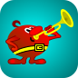

## Lines for Sailfish OS and Aurora OS

[En]
Classic puzzle game. Three color balls are randomly placed on the game board at every round. You have to select one ball by clicking on it and move it to a different location (click on the target square).  Horizontal, vertical or diagonal lines of 5 or more balls of the same color are eliminated, adding to the score and giving you additional move before the next three balls appear on the board. The longer the lines are the more points you earn.

[Rus]
Классическая головоломка. В каждом раунде на игровом поле случайным образом размещаются шарики трех цветов. Вы должны выбрать один шар, щелкнув на нем, и переместить его в другое место (щелкните на целевом квадрате). Горизонтальные, вертикальные или диагональные линии из 5 и более шариков одного цвета уничтожаются, что увеличивает количество очков и дает дополнительный ход до появления на игровом поле следующих трех шариков. Чем длиннее линии, тем больше очков вы заработаете.